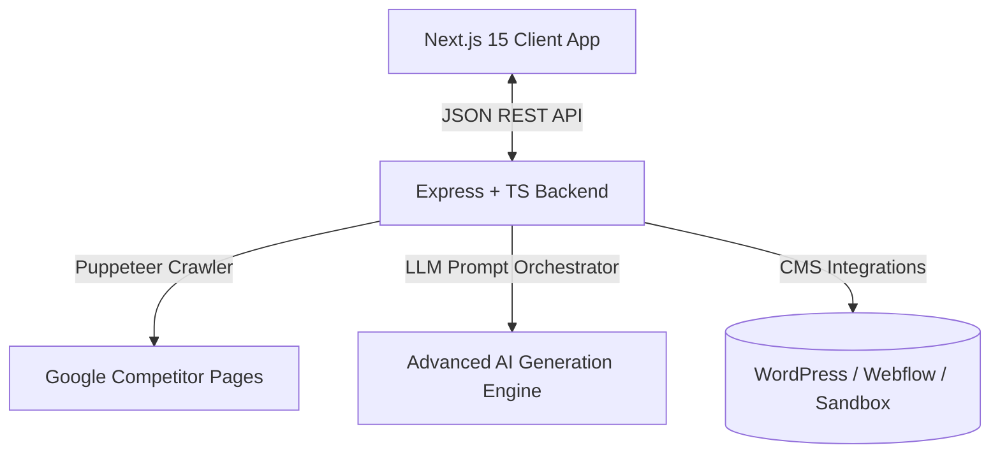

# 🚀 Agentic SEO & Content Autopilot

A high-performance, professional-grade **AI-Assisted Software Engineering** showcase that automates competitor SERP analysis, conducts semantic outline mapping, and orchestrates deep HTML article drafting with real-time SEO validation and automated CMS publishing. 

This platform is a **highly functional, high-fidelity rapid prototype (Proof of Concept)** designed to demonstrate robust **System Thinking** and **Human-in-the-Loop Orchestration** within automated content marketing workflows.

> [!NOTE]
> ⏱️ **The 4-Hour High-Speed Engineering Challenge**
> This entire full-stack platform—comprising Puppeteer scrapers, multi-agent AI semantic planners, an interactive React-based layout editor, and robust error fallback databases—was fully architected, coded, styled, and validated in **under 4 hours** as a showcase of modern **AI-assisted rapid prototyping**. 
>
> It serves as a proof of concept demonstrating how a senior engineer leveraging agentic workflows can move from concept to a gorgeous, production-grade functional prototype with extreme velocity, without sacrificing structural patterns or type safety.

---

## 🎨 Interface Design & User Experience

The user interface features a clean, highly functional light-mode design optimized for clarity and responsiveness:
- **Harmonious HSL Palettes:** Utilizes a curated, professional palette of soft grays, rich charcoal typography, and clean contrast points to ensure high readability.
- **GPU-Accelerated Micro-Animations:** Dynamic UI elements leverage hardware-accelerated animations (`translate3d`, `will-change`) to deliver fluid, responsive transitions.
- **Custom-Engineered Select Dropdowns:** Bypasses native browser controls with React-stateful select menus featuring dynamic z-index overlays to ensure clean layering over dashboard contents.
- **Fluid Responsive Grids:** Implements flexible CSS Grid and Flexbox layouts to maintain visual hierarchy and structure across all viewport sizes.

---

## 🤖 Advanced Agentic Capabilities

This showcase has been recently upgraded with state-of-the-art agentic workflows and automated loops that elevate it into a fully autonomous SEO operation:

### 1. GEO Citation Scorer (Generative Engine Optimization)
- **Deep Cognitive Analysis:** Evaluates the generated copy against generative search engine algorithms (Gemini, Perplexity, OpenAI Search).
- **Vulnerability & Entity Extraction:** Automatically calculates an advanced **GEO Score**, lists extracted semantic entities, and recommends immediate content enhancements to maximize citation and source referencing rates.

### 2. Multi-Agent SEO War Room (Live Stream)
- **Real-Time Agentic Orchestration:** Visualizes the parallel execution of dedicated sub-agents (**Orchestrator Agent**, **Researcher Agent**, **Strategist Agent**, **Writer Agent**, **Creative Designer**, and **Technical SEO Auditor**).
- **Collaborative Log Stream:** Users can watch the live dialog and technical collaboration steps taken by specialized agents in real-time as they outline, optimize, crawl, design, and publish.

### 3. Competitor Watcher & Autonomous Counter-Offensive
- **Sitemap & RSS Scraping:** Constantly monitors or parses competitor domains to identify newly published topics.
- **Topic Cluster Planner:** Automatically generates an AI-driven **Counter-Offensive Plan** comprising core Pillar Posts and supporting semantic sub-articles, instantly adding them to the autonomous queuing system.

### 4. Autonomous Sentinel & Self-Reflection Recovery
- **Continuous Performance Auditing:** Simulates active Google Search Console tracking to detect organic rank drops for active keywords.
- **Self-Reflection Rewrite Engine:** Triggers an autonomous revision agent that compares the underperforming post with live competitors, generates an enhanced semantic rewrite with optimized SurferSEO scores, and presents a ready-to-approve recovery draft in the dashboard for one-click publishing or dismissal.

---

## 🛠️ System Architecture

The application is engineered as a fully decoupled, type-safe full-stack system:



### 1. Frontend Client (`frontend`)
- **Framework:** Next.js 15 (App Router) + TypeScript + Vanilla CSS.
- **On-Page SEO Scorer:** An interactive client-side engine (SurferSEO/Yoast style) calculating live score indexes (0-100) dynamically based on headings, word counts, and target keyword density.
- **Interactive Outline Modifier:** A visual, human-in-the-loop dashboard allowing users to add, modify, reorder, or delete structural headings prior to drafting.
- **Utility Tools:** One-click copy raw HTML code or direct local `.html` file downloader.

### 2. Backend Server (`backend`)
- **Runtime:** Node.js + TypeScript + Express.
- **Puppeteer Competitor Scraper:** Headless browser integration that queries Google SERPs in English (`&hl=en`), extracts ranking competitor URLs, and deep-crawls their body outlines and heading structures.
- **Two-Stage Generation Pipeline:**
  1. **Outline Mapper:** Consolidates competitor heading patterns, maps keywords, and targets specific semantic requirements.
  2. **Copywriting Engine:** Leverages advanced AI models to draft comprehensive, plagiarism-free HTML content matching specified tones (Professional, Casual, Academic, Sales) and injects Schema.org JSON-LD `FAQPage` markups.
- **Unified Publishing Service:** Integrates with WordPress REST API, Webflow CMS v2 API, and a local simulation Sandbox.

---

## 🔍 Code Navigation Guide for Hiring Managers

The codebase is structured strictly following clean architecture principles, emphasizing separation of concerns and robust error boundaries. Below are the key files demonstrating core engineering competency:

* **[scraperService.ts](backend/src/services/scraperService.ts):** Evaluates browser automation skills, implementing headless Puppeteer instances to crawl organic competitors safely and extract clean semantic heading patterns.
* **[geminiService.ts](backend/src/services/geminiService.ts):** Showcases advanced prompt engineering, prompt safety constraints, and automated injection of technical SEO JSON-LD schema markup directly inside structured streams.
* **[publishService.ts](backend/src/services/publishService.ts):** Handles external CMS communications, implementing multi-platform API clients (WordPress/Webflow) and a fully offline-safe simulated local publisher.
* **[page.tsx](frontend/src/app/page.tsx):** Displays sophisticated React state management, real-time SEO scoring algorithm, human-in-the-loop interactivity, and state synchronization across multiple visual stages.
* **[globals.css](frontend/src/app/globals.css):** Showcases structural CSS layout mastery, typography rules, custom-tailored light-mode aesthetics, custom variable tokens, and hardware-accelerated user animations.

---

## ⚡ Engineering Quality & Best Practices

Rather than just displaying AI-generated code, this repository demonstrates rigorous engineering around LLM boundaries:

* **Human-in-the-Loop Verification:** Recognizes that AI works best under human guidance. Rather than going from keyword to finished article blindly, the pipeline enforces a multi-step workflow: **Analyze Competitors ➡️ Interactive Outline Editor (Human Action) ➡️ Draft Article ➡️ Verify SEO Score ➡️ Publish**.
* **Robust Error Handling & API Fallbacks:** Avoids runtime crashes. When third-party API quotas are reached or schema queries fail, the system falls back onto safe simulated states, mock API sandbox publishing, and localized data loaders.
* **Security & Secret Hygiene:** The project strictly implements zero-credential-leakage standards. Configuration paths utilize `.env` variables, and templates explicitly separate code from secrets.
* **Dynamic Stacking Fixes:** Implements state-driven CSS overlays on relative containers to guarantee select dropdowns display cleanly above all dashboard contents.

---

## 🚀 Getting Started

### 📦 Prerequisites
- **Node.js:** v18 or higher
- **NPM:** Installed locally
- **AI Credentials:** A Google Gemini API Key

### 💻 Local Setup & Execution

#### 1. Clone & Navigate
```bash
git clone <your-repo-url>
cd agentic-seo
```

#### 2. Start Backend Server
1. Navigate to the backend directory:
   ```bash
   cd backend
   ```
2. Create and configure your environment variables:
   ```bash
   cp .env.example .env
   # Add your GEMINI_API_KEY inside the .env file
   ```
3. Install dependencies and start the hot-reloading dev server:
   ```bash
   npm install
   npm run dev
   ```
4. The server runs locally on: **`http://localhost:5001`** (Health status available at `/api/health`).

#### 3. Start Frontend Dashboard
1. Open a new terminal and navigate to the frontend directory:
   ```bash
   cd frontend
   ```
2. Install client dependencies and run the Next.js development server:
   ```bash
   npm install
   npm run dev
   ```
3. Open your browser and navigate to: **`http://localhost:3000`**
