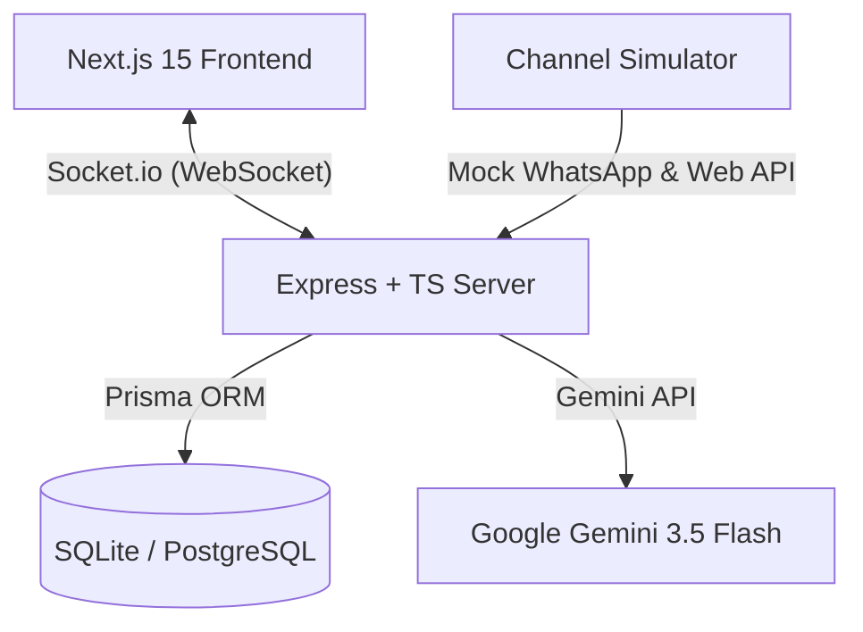

# 🚀 AI Support Desk & Real-Time Copilot

A high-performance, professional-grade **AI-Assisted Customer Support & Copilot** showcase that automates incoming customer tickets across multiple simulated channels, utilizes real-time WebSockets, and integrates Google Gemini for dynamic, human-in-the-loop response drafting.

This platform is a **highly functional, high-fidelity rapid prototype (Proof of Concept - PoC)** designed to demonstrate robust **Real-Time Systems Thinking**, **Structured Zod Payload Validation**, and **Human-in-the-Loop AI Orchestration** within modern customer service workflows.

---

## 🎨 Interface Design & User Experience

The user interface features a state-of-the-art design optimized for fast-paced support operations with full light/dark mode persistence:
- **Premium Glassmorphism & Color Systems:** Utilizes a curated, professional palette using HSL CSS custom variables, vibrant active border glows, soft background blurs, and deep charcoal/slate typography to ensure readability and high-end visual appeal.
- **Interactive Micro-Animations:** Dynamic UI elements leverage hardware-accelerated transitions (`translate3d`, `will-change`) for fluid hover states, real-time message bubble expansions, and sliding sidebars.
- **Dynamic CSS Theme System:** A fully reactive light/dark mode toggler with immediate local storage persistence and custom-tailored contrast ratios.
- **Real-Time Search & Live Filters:** Instant, client-side ticket search and status filters (Open vs. Resolved) synchronized seamlessly across the UI list.

---

## 🛠️ System Architecture

The application is engineered as a fully decoupled, type-safe full-stack system communicating over real-time bi-directional WebSockets:



### 1. Frontend Client (`frontend`)
- **Framework:** Next.js 15 (App Router, Turbopack) + TypeScript + Vanilla CSS.
- **Real-Time Workspace:** Implements a Socket.io hook that handles client reconnection, incoming ticket broadcasts, and typing indicator events.
- **AI Copilot Drawer:** An interactive sidebar containing Gemini-drafted suggestions with live tone modifiers (Professional, Friendly, Empathetic, Persuasive) allowing agents to modify and approve final drafts before sending.
- **Stateful Widgets:** Features custom toast notifications, skeleton loaders for analytics charts, and dynamic relative timestamps.

### 2. Backend Server (`backend`)
- **Runtime:** Node.js + TypeScript + Express + Socket.io.
- **Zod Validation Guard:** All incoming Socket.io payload parameters are checked in real-time using Zod schemas to ensure absolute type safety and eliminate execution crashes.
- **Prisma Compound Constraint DB:** Employs SQLite in development (and is production-ready for PostgreSQL) with composite unique indexes to prevent customer duplication.
- **Dynamic Channel Simulator:** Periodically generates mock customer queries mimicking different communication channels (WhatsApp, Web Chat) to demonstrate real-time pipeline capability.

---

## 🔍 Code Navigation Guide for Hiring Managers

The codebase is structured strictly following clean architecture principles, emphasizing separation of concerns and robust error boundaries:

* **[server.ts](backend/src/server.ts):** Evaluates socket orchestration skills, Express REST endpoint configuration (including computed analytics metrics from raw database rows), and error handling boundaries.
* **[geminiService.ts](backend/src/services/geminiService.ts):** Showcases advanced prompt engineering, custom instructions based on tone parameters, and structured JSON parsing boundaries.
* **[validation.ts](backend/src/lib/validation.ts):** Demonstrates backend hardening via strict Zod input validation schemas for real-time WebSocket payloads.
* **[channelSimulator.ts](backend/src/services/channelSimulator.ts):** Features automated background task runners using a robust `findOrCreateCustomer` database pattern to guarantee data consistency.
* **[useSocket.ts](frontend/src/hooks/useSocket.ts):** Displays advanced custom React hook logic orchestrating live socket states, reconnect limits, event listeners, and typing indicator cleanup timers.
* **[globals.css](frontend/src/app/globals.css):** Showcases pure, modern Vanilla CSS layout mastery, featuring high-end custom variables, theme tokens, scrollbar styling, and dynamic CSS transitions.

---

## ⚡ Engineering Quality & Best Practices

Rather than just displaying AI-generated code, this repository demonstrates rigorous engineering around LLM boundaries and production standards:

* **Human-in-the-Loop Autopilot:** Employs the ultimate AI design pattern where the LLM serves as a supportive Copilot. The agent remains in total control, validating, refining, or completely rewriting drafts before sending them.
* **Database & Secret Hygiene:** Zero hardcoded API keys. The system uses strict `.env` variables and provides `.env.example` templates, ensuring a seamless local setup.
* **Zod Payload Hardening:** Protects WebSocket endpoints from corrupt or malicious data injections, immediately returning safe validation alerts rather than crashing the runtime server.
* **Zero-Dependency Styling:** Developed completely without heavy TailwindCSS bundles, proving raw CSS layout, flexing, and responsiveness expertise.

---

## 🚀 Getting Started

### 📦 Prerequisites
- **Node.js:** v18 or higher
- **NPM:** Installed locally
- **AI Credentials:** A Google Gemini API Key

### 💻 Local Setup & Execution

#### 1. Clone & Navigate
```bash
git clone <your-repo-url>
cd ai-support-desk
```

#### 2. Start Backend Server
1. Navigate to the backend directory:
   ```bash
   cd backend
   ```
2. Create and configure your environment variables:
   ```bash
   cp .env.example .env
   # Add your GEMINI_API_KEY inside the .env file
   ```
3. Install dependencies, run Prisma migrations, and start the development server:
   ```bash
   npm install
   npx prisma db push
   npm run dev
   ```
4. The server runs locally on: **`http://localhost:5002`** (Health status available at `/api/health`).

#### 3. Start Frontend Dashboard
1. Open a new terminal and navigate to the frontend directory:
   ```bash
   cd frontend
   ```
2. Create and configure your environment variables:
   ```bash
   cp .env.example .env.local
   ```
3. Install client dependencies and run the Next.js development server:
   ```bash
   npm install
   npm run dev
   ```
4. Open your browser and navigate to: **`http://localhost:3001`** (Login with any credentials for demo mode).

---

## 📊 API Endpoints & Real-Time Events

### REST API
- `GET /api/health` - Health check status.
- `GET /api/analytics` - Computes live KPI metrics (Resolution Rate, Average Response Time, Channel Distribution).
- `POST /api/simulator/trigger` - Manual trigger to generate a new simulated incoming ticket immediately.

### Socket.io Events
- `message:send` - Sent by agents to send a message.
- `message:received` - Received when a customer/simulator sends a message.
- `typing:status` - Broadcasts real-time typing indicators across connected clients.
- `ticket:resolve` - Triggers ticket status updates to the database and connected dashboards.

---

## 📄 License

MIT License. Designed with excellence.
